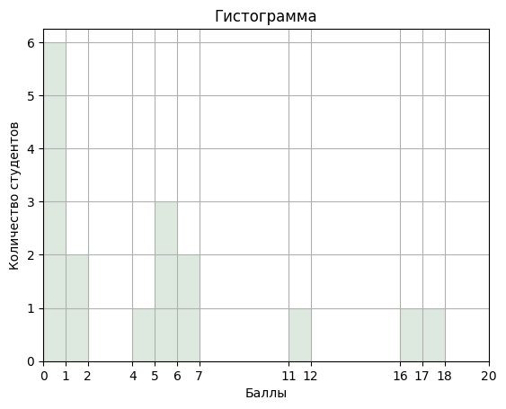

+++
title = "РФ23-01Б: Практика N17"
template = "page.html"
date = 2023-10-31
[taxonomies]
tags = ["rf23-01b", "MA1"]
[extra]
summary = "Контрольная работа N1"
mathjax = "tex-mml"
+++

<!-- more -->
## Контрольная работа N1

### Обобщенные результаты


### Построение гистограммы

```
import pandas as pd
import numpy as np
import matplotlib.pyplot as plt

results = {'score': [0.55, 0.05, 0.28, 0.05, 0, 0, 0, 0, 0.2, 0.02, 0, 0.3, 0.34, 0.9, 0.26,0.8, 0.28]}
df = pd.DataFrame(results)*20

hist = df.hist(grid = True, bins=18,  color='#dde9df')
plt.title('Гистограмма')
plt.axis((0, 20, 0, 6.25))
plt.xticks([0,1,2,4,5,6,7,11,12, 16,17,18,20]) 
plt.xlabel('Баллы')
plt.ylabel('Количество студентов')
```