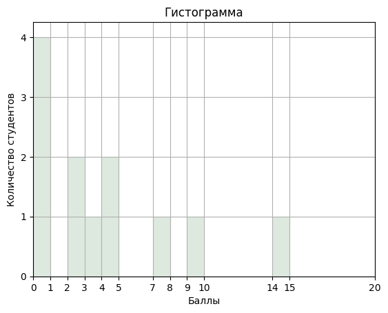

+++
title = "БФ23-05Б: Практика N16-17"
template = "page.html"
date = 2023-11-06
[taxonomies]
tags = ["bf23-05b", "MA1"]
[extra]
summary = "Контрольная работа. Непрерывность функций"
mathjax = "tex-mml"
+++

<!-- more -->

## Контрольная работа  N1

### Обобщенные результаты

## Непрерывность функций

**Д674в** Доказать, что функция $x^3$ непрерывна на $\mathbb{R}.$

Пусть $x_0\in \mathbb{R}$. Рассмотрим величину
$$ 
    |x^3-x_0^3|=|((x-x_0)+x_0)^3-x_0^3|=|(x-x_0)^3+3x_0 (x-x_0)^2+3x_0^2(x-x_0)|\leq
$$
$$
    \leq |x-x_0|^3+3|x_0||x-x_0|^2+3 |x_0|^2 |x-x_0| < \delta^3+3|x_0|\delta^2+3 |x_0|^2 \delta = \varepsilon
$$
Найдем значение $\delta$ из уравнения
$$
    \delta^3+3|x_0|\delta^2+3 |x_0|^2 \delta = \varepsilon,
$$
$$
    \delta^3+3|x_0|\delta^2+3 |x_0|^2 \delta +|x_0|^3= \varepsilon+|x_0|^3,
$$
$$
    (\delta+|x_0|)^3=\varepsilon+|x_0|^3,
$$
$$
    \delta=\sqrt[3]{\varepsilon+|x_0|^3}-|x_0|>0.
$$
Таким образом, величина $|x^3-x_0^3|<\varepsilon$, если $x\in \mathbb{R}$ такой, что 
$|x-x_0|<\delta=\sqrt[3]{\varepsilon+|x_0|^3}-|x_0|.$ Поэтому функция $x^3$ непрерывна в точке $x_0\in\mathbb{R}$.
Поскольку точка произвольная, то $x^3\in C(\mathbb{R}).$

### Домашняя работа

1. Д664, Д667.
2. Д674гдежз.

