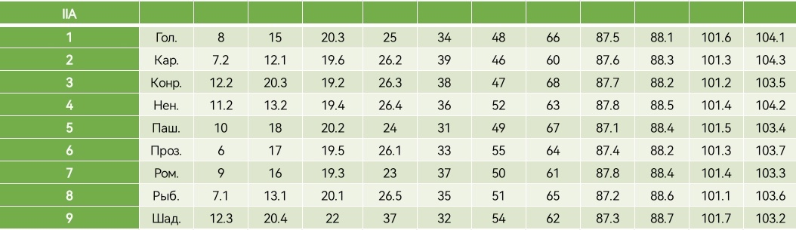
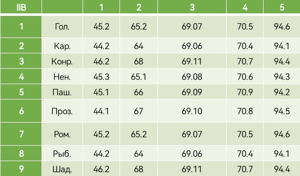

+++
title = "РФ22-01Б: Практика N14"
template = "page.html"
date = 2023-12-01
[taxonomies]
tags = ["rf22-01b", "MA3"]
[extra]
summary = "Криволинейные интегралы (продолжение)"
mathjax = "tex-mml"
+++

<!-- more -->

## Криволинейные интегралы (продолжение)

### Задания для КСР

[Задачи по криволинейным интегралам](IIA.pdf)

1. [Первые две задачи брать отсюда](IIB_1.pdf)
2. [Оставшиеся три брать отсюда](IIB_2.pdf)